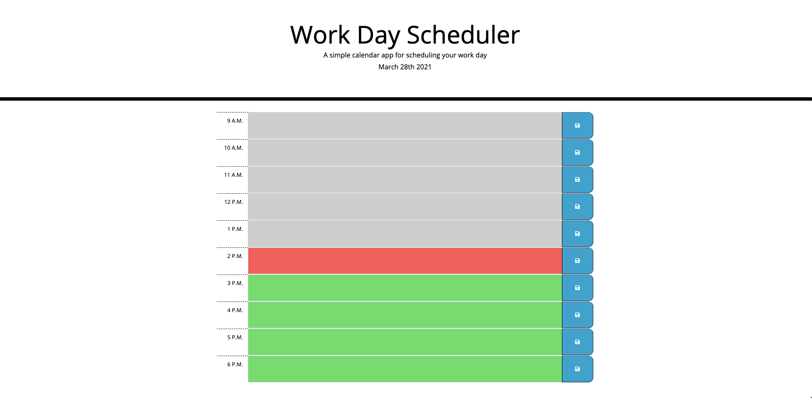
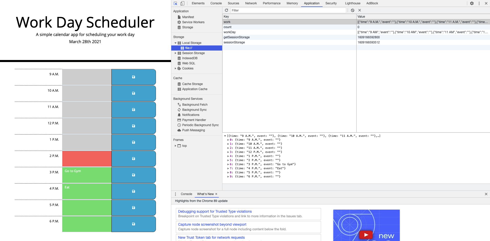

# homework-5-Workday-Scheduler

# Homework-5

## Project Overview

This is my homework #5 Workday-Scheduler.

Objective from this week's homework was to build a simple calendar application that allows a user to save events for each hour of the day by modifying starter code. This app will runi in the browser and feature dynamicallly updated HTML and CSS powered by jQuery.

My logic behind this week's homework was to start with a starter HTML and CSS that was given to me. The HTML already included BOOTSTRAP and jQuery document library imported. As a result, I only had to write in Script.JS file.

1. I started by declaring two variables of "todayDate", and "timeNow" and got the format from the moment library.
2. Once two variables were declared I created an Array of Objects with variable name "dailyWork", and stored time from 9 A.M. - 6 P.M. Which are the times that I was using for the project.
3. For the rest of the steps I had to set getItem & setItem from local storage so that user input were being saved into local storage. Also, I created two functions and for each loop so that the time I created in Array of "dailyWork" would display into the page.

Attached is my screenshot of my workday scheduler.

## Attached is also a personal link to my homework assignment #5

## https://jung0808.github.io/homework-5-workday-scheduler/

## https://github.com/jung0808/homework-5-workday-scheduler
